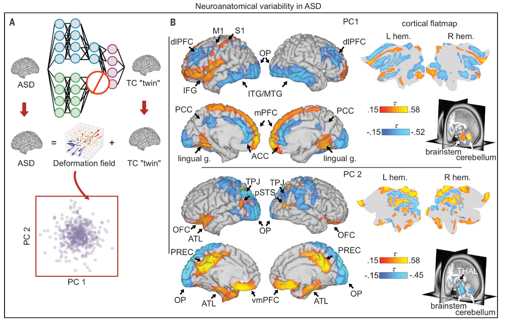
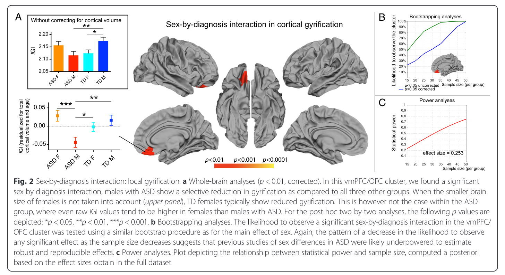

# Conception for the research question

## *Autism Spectrum Disorder*
Autism spectrum disorder, or ASD, is a neurodevelopmental disorder characterized by behavioral deficits in social communication, including non-verbal communication like body language; restricted interests; and repetitive behaviors, such as repetitive and stereotyped motor movements and inflexible adherence to routines [(Hodges, Fealko, & Neelkamal, 2020)](https://www.ncbi.nlm.nih.gov/pmc/articles/PMC7082249/). As it is defined as a neurodevelopmental, or neurobiological disorder, influenced by several genetic and environmental factors, ASD is thought to have a large impact on the development of the brain in early infancy resulting in identifiable anatomical and thus behavioral abnormalities. Despite its growing prevalence, there are currently no clear ASD biomarkers or diagnostic measures to identify ASD in children. Its diagnosis is made solely based on the fulfillment of descriptive criteria.

Symptomatically and behaviorally, ASD affects males and females differently. It is theorized that ASD is expressed in domains of empathy, which allow for the identification and reaction to others mental states, and systemizing, which allows for analysis and construction of systems [(Beacher et al., 2012)](http://www.ajnr.org/lookup/doi/10.3174/ajnr.A2880). [Baron-Cohen (2009)](https://pubmed.ncbi.nlm.nih.gov/19338503/) note that in the general population, females tend to be more empathetic, whereas males are more systematic. Based on this proposition, [Baron-Cohen & Wheelwright (2004)](https://pubmed.ncbi.nlm.nih.gov/15162935/) suggest that males on the Autistic spectrum represent an extreme typical male profile, or the extreme male brain, with very low levels or even impaired empathy and typical or enhanced systemizing abilities. Females, on the other hand, tend to camouflage their ASD symptoms [(Schuck, Flores, & Fung, 2019)](https://www.ncbi.nlm.nih.gov/pmc/articles/PMC6753236/), which is proposed to contribute to the low detection and prevalence rates of ASD in females. Camouflaging refers to the modification of outward social expression and displaying learned social behaviors, such as facial expressions and eye contact, to appear more typical [(Hull, Mandy, & Petrides, 2017)](https://journals.sagepub.com/doi/10.1177/1362361316669087).

## *Neurobiological Markers for Autism Spectrum Disorder*
Since its etiology is still unclear, recent research has started looking into the potential neurobiological markers for ASD. The goal of identifying neurobiological, or neuroanatomical, differences between individuals with ASD and individuals with neurotypical brain development is to inform diagnosis and aid in personalizing interventions. One of these studies found, using deep learning to extract ASD-specific variation from typical brain variation, that ASD-specific neuroanatomical variation correlated with symptomatic differences between participants [(Aglinskas, Hartshorne, & Anzellotti, 2022)](https://www.science.org/doi/10.1126/science.abm2461). They further identified that individuals with ASD are organized along a continuous dimension of distinct sets of brain regions, as opposed to clustering into separate subtypes as previously hypothesized. This is a very important new finding in the field of diagnostics as the previously trained model can be used on new individuals to disentangle ASD-specific features.

Figure 1: *[(Aglinskas, Hartshorne, & Anzellotti, 2022](https://www.science.org/doi/10.1126/science.abm2461)*

The discovery that ASD-specific neuroanatomical variation correlates with symptomatic individual differences prompts the question: if symptoms of ASD elicit different neuroanatomical variation, and there are clear behavioral and symptomatic distinctions between males and females with ASD, are there identifiable ASD-specific neuroanatomical sex differences? And can an ASD diagnosis be predicted using anatomical brain images and comparing these to neurotypical individuals?

## *Neurobiological Sex Differences in Autism Spectrum Disorder*
To investigate this concept of sex-related anatomical differences in individuals with ASD, [Beacher et al., (2012)](http://www.ajnr.org/lookup/doi/10.3174/ajnr.A2880) performed structural neuroimaging on gray and white matter volume. They identified significant interactions between sex and diagnosis in total white matter volume and in regional gray matter volume. They also found that the typical sexual dimorphism seen in controls was reduced or completely absent in participants with ASD, and that there was no evidence to support the proposition of the existence of an "extreme male brain" in males with Autism. While this study makes good initial predictions of potential neuroanatomical sex differences in males and females, it is based on a primarily high-functioning data set, which ignores possible anatomical differences that may occur in individuals with different and low-functioning forms of ASD. 

A similar assessment of sex differences in cortical volume and gyrification in ASD by [Schaer et al., (2015)](https://doi.org/10.1186/s13229-015-0035-y) found that some typical structural sex differences are preserved in ASD while others are not. They identified sex-specific alterations and preservations in clusters of cortical regions associated with language and social function, key areas of deficient function in ASD. These findings elucidate neurobiological mechanisms which may be associated with those sex-specific autistic symptoms, as well as those which are shared. However, this study used the ABIDE I dataset, which again only provides the data of high-functioning individuals due to the difficulties acquiring data of low-functioning children and adolescents. In addition to this, their study lacked heterogeneity within the ASD symptoms and severity.

Figure 2: *[Schaer et al., (2015)](https://doi.org/10.1186/s13229-015-0035-y)

## *Hypothesis and Research question*  
Based on these previous findings, and the lack of research into these apparent sex differences in individuals with ASD, we formulated our research questions: are there differences in the cortical thickness of certain areas between males and females with ASD? Can machine learning predict whether someone has ASD based on a structural brain image? Can machine learning predict the sex of a participant based on a structural brain image?

We hypothesize that a machine learning classifier will be able to predict group and sex based on cortical thickness data of 148 regions of interest.

## *Assessment and Explanation of the Open dataset*
Open datasets with data on participants with Autism Spectrum disorder and its related anatomical information are hard to come by. Thus far, there are two main open datasets that are somewhat accessable and easy to use - [ABIDE I](http://fcon_1000.projects.nitrc.org/indi/abide/abide_I.html) and [ABIDE II](http://fcon_1000.projects.nitrc.org/indi/abide/abide_II.html). Both of these ['Autism Brain Imaging Data Exchange'](http://fcon_1000.projects.nitrc.org/indi/abide/) datasets consist of MRI data collected at various sites across the world. Both of these datasets are made up of resting-state fMRI data, anatomical, and phenotypic data. Since the ABIDE I dataset was the first of its kind, it presented with some issues which encouraged the collection of an even larger and better-characterized sample. These issues were based on the general heterogeneity of the Autism Spectrum disorder as well as the complexity of its neural connections in the brain, or the connectome. While ABIDE I already yielded data from 1112 individuals with a significant age range, it is primarily made up of high-functioning participants. In addition to this, the combination of data from several sites results in some significant differences and potential biases surrounding demographic aspects and anatomical images. For example, information regarding IQ was only collected by a few sites, resulting in only an estimation of how many high-functioning individuals were included in the sample. ABIDE II, the newer version of the two datasets, aggregated more than 1000 more datasets with better phenotypic characterization as well as longitudinal information from 38 individuals.

Both of these datasets are relatively difficult to obtain, despite their goal being for the use in open science projects. Since they are the only two somewhat openly available large datasets with anatomical data of individuals with ASD, we tried to get access to one of them. Considering ABIDE II is still relatively new, its accessibility is limited. For that reason, we were only able to get access to the more limited and less high-quality ABIDE I dataset via the [NITRC website](https://www.nitrc.org/projects/fcon_1000/?feedback=Your%20request%20has%20been%20submitted.).

As mentioned above, ABIDE I comes with some limitations. Those being that the quality of the data is, in comparison to that collected for ABIDE II, simply sufficient. The demographic information collected from each institution does not completely match up, which impacts demographic analyses that might be desired, such as IQ scores to determine the functionality of the participants. In conjunction with this, while ABIDE provides a .csv file with demographic information, its labels are not sufficiently explained. However, it also has some benefits. The first, very notable one, being its size. This is a significantly large dataset, which allows for a large amount of anatomic variation to be taken into consideration during the analysis. On top of this, the age range of its participants is considerable, and allows for age-related analyses to be carried out. Overall, while the ABIDE I dataset is not as high-quality as is suggested the ABIDE II dataset will be, it is definitely sufficient for the aims of this Neurocognitive psychology project.

## *Software Packages*
Some of the packages used for the project are:
- numpy - which was used for various things, including participant matching
- pandas - used to read the phenotypic csv file
- sklearn
- scikit
- matplotlib - to plot phenotypic information
- seabourn - to plot scatter graphs
- nibabel - to load the anatomical images
- nilearn - to produce a masker for the anatomical data

A more detailed list of these packages can be found in the [requirments_project.txt](https://github.com/Gretivan/Neurocognitive_Psychology) file on GitHub. Please find instructions of how to use these in [Data- and Project management](https://gretivan.github.io/Neurocognitive_Psychology/general_information/datamanagement.html#computational-environment). 

## *References*

Aglinskas, A., Hartshorne, J. K., & Anzellotti, S. (2022). Contrastive machine learning reveals the structure of neuroanatomical variation within autism. Science, 376(6597), 1070-1074. https://doi.org/10.1126/science.abm2461

Hodges, H., Fealko, C., & Soares, N. (2020). Autism spectrum disorder: definition, epidemiology, causes, and clinical evaluation. Translational pediatrics, 9(Suppl 1), S55. https://doi.org/10.21037/tp.2019.09.09

Beacher, F. D., Minati, L., Baron-Cohen, S., Lombardo, M. V., Lai, M. C., Gray, M. A., ... & Critchley, H. D. (2012). Autism attenuates sex differences in brain structure: a combined voxel-based morphometry and diffusion tensor imaging study. American Journal of Neuroradiology, 33(1), 83-89. https://doi.org/10.3174/ajnr.A2880

Schuck, R. K., Flores, R. E., & Fung, L. K. (2019). Brief report: Sex/gender differences in symptomology and camouflaging in adults with autism spectrum disorder. Journal of autism and developmental disorders, 49, 2597-2604. https://doi.org/10.1007/s10803-019-03998-y 

Schaer, M., Kochalka, J., Padmanabhan, A., Supekar, K., & Menon, V. (2015). Sex differences in cortical volume and gyrification in autism. Molecular Autism, 6, 1-14. https://doi.org/10.1186/s13229-015-0035-y

Baron‐Cohen, S. (2009). Autism: the empathizing–systemizing (E‐S) theory. Annals of the New York Academy of Sciences, 1156(1), 68-80. https://doi.org/10.1111/j.1749-6632.2009.04467.x

Baron-Cohen, S., & Wheelwright, S. (2004). The empathy quotient: an investigation of adults with Asperger syndrome or high functioning autism, and normal sex differences. Journal of autism and developmental disorders, 34, 163-175. https://doi.org/10.1023/b:jadd.0000022607.19833.00

Hull, L., Mandy, W., & Petrides, K. V. (2017). Behavioural and cognitive sex/gender differences in autism spectrum condition and typically developing males and females. Autism, 21(6), 706-727. https://doi.org/10.1177/1362361316669087
